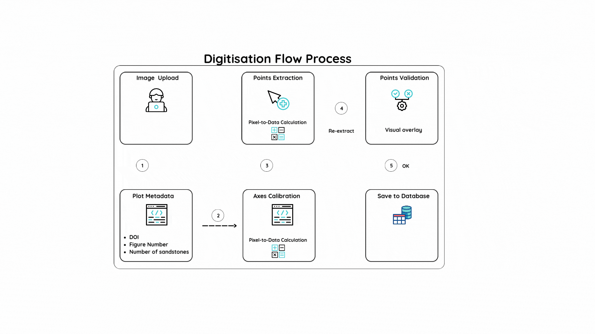

# 🔬 Q-P Plot Digitizer

A data mining tool for extracting rock mechanics data from published research papers and open access theses. This tool digitizes Q-P (differential stress vs. mean stress) plots to create statistically significant datasets. 

[](https://www.python.org/downloads/)
[](https://streamlit.io/)
[](https://www.postgresql.org/)
[](https://opensource.org/licenses/Apache-2.0)


## Project Overview

This innovative project tests the hypothesis that **rock failure strength can be predicted using only grain size and porosity values** - based on the equivalence of critical state soil mechanics and Byerlee friction (Rutter & Glover, 2012).
<br>
<br>

[LINK TO THE PLOT DIGITISATION TOOL](https://qp-digitiser.streamlit.app/)
<br>
<br>


## Features

### Plot Digitization
- Upload Q-P plot images (PNG, JPG, JPEG)
- Interactive axis calibration with visual feedback
- Per-sandstone data extraction and validation
- Real-time point visualization with customizable colors

### Data Management
- PostgreSQL database with comprehensive schema
- Browse and search digitized plots
- Export data as CSV files
- Bulk data operations

### Database Querying
- **SQL Interface**: Direct database queries with safety controls
- **Natural Language Queries**: AI-powered query generation
- Query history and examples
- Read-only access with automatic limits


##  Usage

### 1. Digitize a Plot
1. **Upload**: Select a Q-P plot image
2. **Configure**: Enter DOI, figure number, and number of sandstone datasets
3. **Calibrate**: Click on known axis points to set coordinate system
4. **Extract**: Click on data points for each sandstone individually
5. **Validate**: Review extracted points with visual overlay
6. **Save**: Automatic database storage after validation

### 2. Manage Data
- Browse all digitized plots with search and filtering
- View detailed statistics and data points
- Export individual plots or bulk data as CSV
- Delete plots with cascade removal

### 3. Query Database
- **SQL Tab**: Write custom SQL queries with built-in examples
- **AI Tab**: Ask questions in natural language
- View results in formatted tables
- Export query results as CSV

## Citation

If you use this tool in your research, please cite:

```bibtex
@software{qp_digitizer_2024,
  title={Q-P Plot Digitizer: A Tool for Rock Mechanics Data Extraction},
  author={[Sadiq Balogun] and [Dave Healy]},
  year={2024},
  url={https://github.com/sa-diq/rock-density},
  note={School of Earth \& Environment, LIDA, British Geological Survey}
}
```

**Reference**: Rutter, E.H. and Glover, P.W.J. (2012). The deformation of porous sandstones; are Byerlee friction and the critical state line equivalent? *Journal of Structural Geology*, 44, 129-140.

## License

This project is licensed under the MIT License - see the [LICENSE](LICENSE) file for details.

## Research Collaboration

This project links collaborators from:
- **School of Earth & Environment** 
- **Leeds Institute for Data Analytics (LIDA)**
- **British Geological Survey (BGS)**
